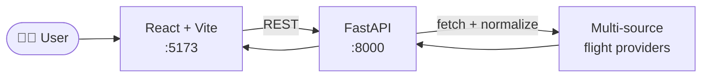

<!-- Banner -->
<p align="center">
  
</p>

<p align="center">
  
  
  
  
  
</p>

<p align="center">
  <i>여러 항공사 일정을 한 화면에서, 한눈에.</i>
</p>

---

## ✨ 주요 기능

- 🛫 **통합 검색** — 출발지·도착지·날짜로 국내선 한번에 조회
- 💰 **운임 비교** — 항공사별 가격·시간 동시 노출
- ⏱️ **실시간 갱신** — 백엔드에서 멀티 소스 동시 폴링
- 🪟 **데스크톱 단축키** — `start.bat` 한 번으로 백+프 동시 실행

---

## 🧬 아키텍처



---

## 🛠️ Tech Stack

| 영역 | 기술 |
|------|------|
| **Frontend** | React (Vite) |
| **Backend** | Python · FastAPI |
| **DevX** | Windows `.bat` 통합 실행, 데스크톱 바로가기 자동 생성 |

---

## 🚀 실행

```bash
# 한번에 실행 (백엔드 + 프론트엔드)
start.bat

# 또는 따로 실행
start-backend.bat       # FastAPI :8000
start-frontend.bat      # Vite :5173
```

> 데스크톱 단축키를 만들려면: `create_shortcut.ps1` 실행

---

## 📁 구조

```
travel/
├── frontend/                  # React (Vite)
├── backend/                   # FastAPI
├── start.bat                  # 통합 실행
├── start-backend.bat
├── start-frontend.bat
└── create_shortcut.ps1        # 바탕화면 바로가기 생성
```

---

<p align="center">
  <sub>⚡ Compare. Choose. Fly. ⚡</sub>
</p>
