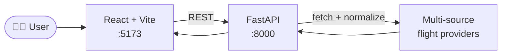

<!-- Banner -->
<p align="center">
  
</p>

<p align="center">
  
  
  
  
  
</p>

<p align="center">
  <i>여러 항공사 일정을 한 화면에서, 한눈에.</i>
</p>

---

## ✨ 주요 기능

- 🛫 **통합 검색** — 출발지·도착지·날짜로 국내선 한번에 조회
- 💰 **운임 비교** — 항공사별 가격·시간 동시 노출
- 📅 **최저가 날짜** — 여행지만 정하면 기간 전체에서 가장 싼 출발일을 찾아준다
- 🗺️ **최저가 목적지** — 날짜를 정하면 그 날 가장 싼 여행지를 찾아준다
- ⏱️ **실시간 갱신** — 백엔드에서 멀티 소스 동시 폴링
- 🪟 **데스크톱 단축키** — `start.bat` 한 번으로 백+프 동시 실행

---

## 🧬 아키텍처


```mermaid
flowchart LR
    User([🧑‍💻 User])
    UI[React + Vite<br/>:5173]
    API[FastAPI<br/>:8000]
    Sources[Multi-source<br/>flight providers]

    User --> UI
    UI -->|REST| API
    API -->|fetch + normalize| Sources
    Sources --> API
    API --> UI
```

---

## 🛠️ Tech Stack

| 영역 | 기술 |
|------|------|
| **Frontend** | React (Vite) |
| **Backend** | Python · FastAPI |
| **DevX** | Windows `.bat` 통합 실행, 데스크톱 바로가기 자동 생성 |

---

## 🚀 실행

```bash
# 한번에 실행 (백엔드 + 프론트엔드)
start.bat

# 또는 따로 실행
start-backend.bat       # FastAPI :8000
start-frontend.bat      # Vite :5173
```

> 데스크톱 단축키를 만들려면: `create_shortcut.ps1` 실행

---

## 📁 구조

```
travel/
├── frontend/                  # React (Vite)
├── backend/                   # FastAPI
├── start.bat                  # 통합 실행
├── start-backend.bat
├── start-frontend.bat
└── create_shortcut.ps1        # 바탕화면 바로가기 생성
```

---

## 📅 최저가 날짜 찾기 (웹 · 최저가 날짜 탭)

여행지와 여행 기간만 고르면 **언제 떠나는 게 제일 싼지**를 찾는다.
Google Flights의 **가격 그래프** 내부 API를 써서 박수당 요청 한 번으로
날짜 범위 전체(최대 161일)의 왕복 최저가를 받아온다.

```
POST /api/flights/best-dates
{ "origin": "ICN", "destination": "FUK",
  "earliest_departure": "2026-10-01", "latest_departure": "2026-11-30",
  "min_nights": 2, "max_nights": 3, "adults": 2 }
```

응답의 `method`가 동작 방식을 알려준다.

| `method` | 의미 |
|----------|------|
| `price_graph` | 가격 그래프 성공 — 기간 전체를 훑었다. 상위 5개 조합만 항공사·시간을 추가 조회한다 |
| `scan` | 가격 그래프 실패 → 날짜별 스캔으로 자동 전환. 범위가 넓으면 균등 샘플링하고 `sampled: true`로 알린다 |

가격 그래프는 Google의 **비공식** 내부 API라 언제든 구조가 바뀔 수 있다.
연결 상태는 화면의 **가격 그래프 연결 테스트** 버튼이나 아래 엔드포인트로 확인한다.

```
GET /api/flights/price-graph/health
```

> 💡 `scan_cheapest.py`와 목적은 같지만 방식이 다르다. 웹 탭은 **한 번의 요청으로 빠르게**
> 훑고, 스캐너는 **날짜마다 실제 항공편을 조회해 항공사·시간까지** 남긴다.
> 대략 훑을 땐 웹 탭, 확정 전 정밀 비교는 스캐너를 쓰면 된다.

---

## 🔎 날짜 범위 최저가 스캐너 (CLI)

특정 날짜가 아니라 **"언제가 제일 싼가"**를 찾는다. 성기게 훑어 저렴한 구간을 찾고(coarse),
그 주변만 하루 단위로 다시 훑는다(refine). 조회 결과는 캐시에 남아 중간에 끊겨도 이어서 돈다.

```bash
cd backend
python scan_cheapest.py --dest CTS --start 2027-02-01 --end 2027-02-28 \
    --nights 2,3,4,5 --step 1 --adults 2 --children 1 --tag sapporo
```

결과는 `backend/out/` 아래 JSON·CSV로 저장된다.

| 옵션 | 설명 |
|------|------|
| `--nights` | 비교할 박수 목록 (`2,3,4,5`) |
| `--coarse-nights` | coarse 단계에서만 쓸 박수 (기본: `--nights` 전체) |
| `--step` | coarse 날짜 간격(일) |
| `--refine-top` / `--refine-window` | 정밀 재탐색할 상위 구간 수 / 앞뒤 ±일 |
| `--no-refine` | coarse만 실행 |

> 💡 가격은 **전체 승객 합계** 기준이다 (성인2+소아1이면 3명 총액).

---

## 🔔 특가 감시 봇

`watchlist.json`에 노선을 등록해두면 정기적으로 훑어 **특가일 때만** 텔레그램으로 알린다.

```bash
python -m watch.main --dry-run              # 조회·판정만
python -m watch.main --only sapporo-feb2027 # 특정 대상만
python -m watch.main --with-deals           # 항공사 프로모션 페이지도 확인
```

**알림 조건** (하나라도 걸리면 발송)

| 조건 | 설정 키 | 의미 |
|------|---------|------|
| 🎯 목표가 | `target_price` | 지정 금액 이하로 하락 |
| 📉 하락률 | `drop_pct` | 직전 관측 대비 N% 이상 하락 |
| 🏆 역대 최저 | `all_time_low` | 과거 최저가 경신 (관측 3회 이상부터) |
| 🔥 할인률 | `discount_pct` | 평소 시세(과거 중앙값) 대비 N% 이상 저렴 |

관측 이력은 `history/<watch-id>.jsonl`에 쌓이고 GitHub Actions가 커밋한다.

> 📌 **항공사 프로모션 페이지 크롤링은 기본 꺼져 있다** (`--with-deals`로 켬).
> 국내 항공사 특가 페이지 대부분이 JS로 목록을 그리는 SPA거나 봇을 차단해서
> 실제로 잡히는 곳이 거의 없다. 대신 **항공사가 특가를 풀면 Google Flights 가격이
> 내려가므로 위의 하락률·할인률 규칙이 그걸 잡는다.** 가격 감시가 더 확실한 특가 감지기다.

**자동 실행**: `.github/workflows/fare-watch.yml`이 매일 09:00 / 21:00 KST에 돈다.
리포지토리 Secrets에 `TELEGRAM_BOT_TOKEN`, `TELEGRAM_CHAT_ID`를 넣어야 발송된다.

> ⚠️ **자동 예약은 지원하지 않는다.** 항공사 결제는 본인인증·3D Secure가 걸려 있어
> 자동화가 불가능하고 시도 자체가 약관 위반이다. 감지 후 예약 페이지 딥링크를
> 즉시 보내주는 것까지가 이 봇의 역할이다.

---

## 🧪 테스트

```bash
pip install -r requirements-watch.txt pytest
python -m pytest tests/
```

네트워크 없이 도는 테스트만 있다. 특가 판정 규칙(`watch/rules.py`)과 가격 그래프의
요청·응답 처리를 검증한다. 가격 그래프 요청은 조금만 어긋나도 **빈 응답**이 올 뿐
오류가 나지 않아 원인 파악이 어렵기 때문에, 요청 페이로드를 Go 참조 구현
(krisukox/google-flights-api)과 대조해서 어긋남을 미리 잡는다.

---

## 🩺 문제 해결

**백엔드가 `ImportError: cannot import name 'FlightData'`로 죽는다면**

`fast-flights` 3.x가 설치된 경우다. 3.x는 이 프로젝트가 쓰는 2.x API(`FlightData`,
`TFSData`)를 없앴다. `requirements.txt`에 `fast-flights==2.2`로 고정해뒀으니 다시 설치한다.

```bash
cd backend && pip install -r requirements.txt
```

**`[PriceGraph FAIL] ... tunnel error` 나 연결 실패가 계속된다면**

방화벽·프록시가 `www.google.com` 접속을 막고 있다. 회사망이나 VPN을 쓰고 있다면 해제 후
다시 시도한다. 연결이 막힌 게 확인되면 30초간 재시도를 멈춰 시간을 낭비하지 않고,
검색 화면에는 Google Flights로 바로 가는 링크가 대신 제공된다.

**`Impersonate 'x' does not exist` 경고가 뜬다면**

`primp` 버전이 올라 `gflights.py`의 `_IMPERSONATE` 값이 사라진 경우다. 무작위 지문으로
떨어지면 차단 위험이 커진다. 유효값을 확인해서 갱신한다.

```bash
python backend/_probe_impersonate.py
```

---

<p align="center">
  <sub>⚡ Compare. Choose. Fly. ⚡</sub>
</p>
