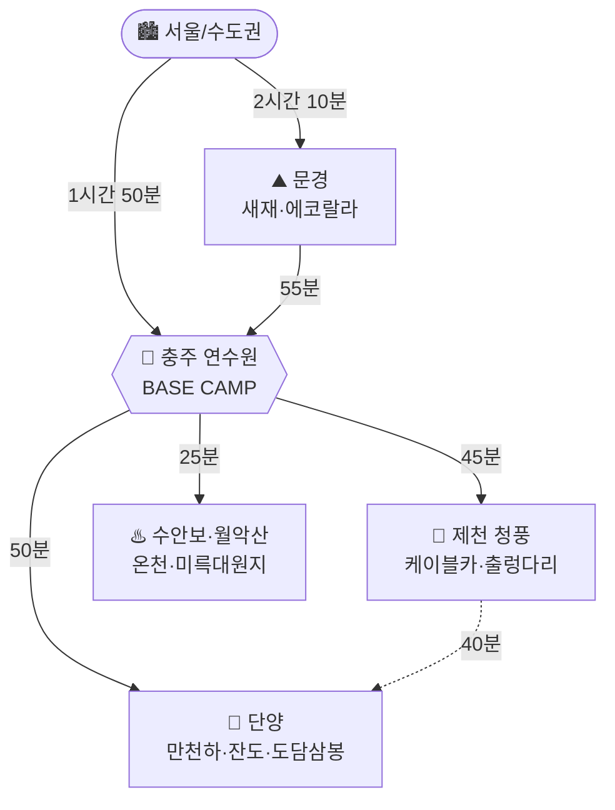

# 충주 연수원 베이스 가족여행 (2026년 10월 말)

> **대상**: 성인 2 + 8세 아이 1, 총 3인 · **이동**: 자차 · **출발지**: 수도권(서울 기준)
> **숙소**: 충주 연수원 (베이스캠프 고정, 매일 같은 방 복귀)
> **날짜**: 2026-10-23(금) ~ 10-26(월) 사이에서 1박2일 또는 2박3일

---

## 0. 결론부터 (TL;DR)

| 안 | 일정 | 코스 요약 | 추천도 |
|---|---|---|---|
| **A안 (강력 추천)** | 10/23(금)~10/25(일) 2박3일 | **문경 → 충주(1박) → 단양 → 충주(2박) → 충주 근교 → 귀경** | ★★★★★ |
| B안 | 10/24(토)~10/26(월) 2박3일 | **충주 → 단양/청풍 → 문경(귀경길)** (월요일 휴무 회피형) | ★★★★☆ |
| C안 | 10/24(토)~10/25(일) 1박2일 | **문경 → 충주(1박) → 충주 근교 → 귀경** | ★★★☆☆ |

**핵심 아이디어**: 충주는 **문경(남서 55분) · 단양(동 50분) · 제천 청풍(북동 45분)** 의 정삼각형 한가운데다.
숙소를 충주에 고정하면 매일 "**당일치기 반경 1시간**" 안에서 완전히 다른 테마를 하나씩 꺼내 쓸 수 있고,
이동 중에 짐을 싸고 푸는 일이 없다. 8세 아이와 다니기에 이보다 좋은 구조는 없다.

**A안을 1순위로 미는 이유**
1. 금요일 출발이라 **문경새재·단양 모두 주말 인파를 반나절씩 피한다.**
2. 마지막 날(일요일)을 **충주 시내 근교**로 짧게 끊어 **오후 2시 전에 출발** → 일요일 저녁 고속도로 정체를 통째로 회피.
3. 10/24~26 코스에서 걸리는 **월요일 휴무 지뢰**(활옥동굴·청풍호반케이블카·옥순봉출렁다리 모두 월요일 휴무)를 아예 안 밟는다.

---

## 1. 지리 구조 — 왜 충주가 베이스로 좋은가

**자차 기준 편도 소요시간 (주말 할증 감안 +20~30분)**

| 구간 | 거리(약) | 시간(약) |
|---|---|---|
| 서울 → 문경새재 | 190km | 2시간 10분 |
| 문경새재 → 수안보 | 25km | 30분 |
| 수안보 → 충주 시내 | 20km | 25분 |
| 문경새재 → 충주 시내 | 45km | 55분 |
| 충주 → 단양 | 45km | 50분 |
| 충주 → 청풍(제천) | 35km | 45분 |
| 충주 → 서울 | 150km | 1시간 50분 |
| 단양 → 서울 | 190km | 2시간 10분 |

> 📍 연수원이 **수안보 쪽**이면 문경이 30분으로 가까워지고 단양이 +15분,
> **충주 시내/충주호 쪽**이면 단양·청풍이 가까워진다. 아래 일정의 ±20분 안에서 흡수되는 차이라 코스 순서는 그대로 써도 된다.

---

## 2. A안 — 2박3일 (10/23 금 ~ 10/25 일) ★추천★

### Day 1 (금) — 문경: 가을 단풍 + 액티비티

| 시간 | 일정 | 메모 |
|---|---|---|
| 07:00 | 서울 출발 | 금요일 아침, 1시간 일찍 나가면 정체 거의 없음 |
| 09:20 | **문경새재도립공원** 도착 | 입장 무료 / 주차 유료 |
| 09:30~12:00 | 제1관문(주흘관) → **전동차** → 제2관문(조곡관) → **오픈세트장** | 8세 아이는 전동차로 오르막 스킵이 정답 |
| 12:15~13:20 | 점심 — 새재 입구 **약돌돼지 석쇠구이** | 아이 메뉴로는 된장찌개+공깃밥 조합 |
| 13:40~16:30 | **에코랄라(문경에코월드)** | 석탄박물관 + 짚라인·모노레일·4D. 아이가 제일 좋아할 구간 |
| 16:30~17:30 | 문경 → 수안보 경유 → **충주 연수원 체크인** | 3번 국도 단풍 드라이브 |
| 18:00~ | 저녁 + 짐 풀기 / 여력 되면 **수안보 온천 족욕** | 첫날은 일찍 재우는 게 3일 전체를 살린다 |

> ⚠️ **에코랄라 키즈월드는 월·화·수 휴장.** 금요일은 정상 운영이라 A안에서만 온전히 쓸 수 있다.
> 🔁 대안: 에코랄라 대신 **문경 레일바이크(진남역/구랑리역, 사전 예약 필수)** 또는 **오미자테마터널**.

### Day 2 (토) — 단양: 하루를 통으로 쓰는 메인 데이

| 시간 | 일정 | 메모 |
|---|---|---|
| 08:00 | 연수원 조식 후 출발 | |
| 09:00~12:00 | **만천하스카이워크** (전망대 + 모노레일) | 짚와이어·알파인코스터·만천하슬라이드는 **키/연령 제한** 있으니 8세 탑승 가능 여부 현장 확인 |
| 12:10~13:20 | 점심 — **단양구경시장** (마늘만두·흑마늘닭강정) 또는 마늘떡갈비 | |
| 13:40~15:00 | **단양강 잔도** 걷기 (편도 1.2km, 왕복 1시간) | 절벽에 매달린 데크길. 아이가 신기해함. 유모차 X, 운동화 O |
| 15:20~16:20 | **도담삼봉 + 석문** | 남한강 위 세 봉우리, 사진 포인트 |
| 16:20~17:20 | 단양 → 충주 연수원 복귀 | |
| 18:00~ | 저녁 / 휴식 | 하루 걷는 양이 많은 날이라 저녁은 숙소 근처에서 간단히 |

> 🔁 **체력이 걱정되면 단양 대신 청풍**: 청풍호반케이블카 + 옥순봉 출렁다리 + 청풍문화재단지.
> 이동이 왕복 1시간 30분 → 1시간 30분으로 줄고 걷는 양이 절반이다. 단, 볼거리 밀도는 단양이 높다.
> ⚠️ 청풍 코스는 **월요일 휴무**라 B안 Day 3에는 못 넣는다.

### Day 3 (일) — 충주 근교 짧게 + 조기 귀경

| 시간 | 일정 | 메모 |
|---|---|---|
| 08:30 | 체크아웃 (짐 차에 싣기) | |
| 09:00~11:00 | **충주 활옥동굴** | 09:00 오픈런. **투명카약 체험 마감 16:00이지만 주말은 조기 마감** → 입장하자마자 카약부터 |
| 11:20~12:20 | **중앙탑사적공원 + 탄금호 산책** | 잔디밭·조각공원, 아이 뛰어놀기 좋음 |
| 12:30~13:40 | 점심 — 중앙탑 일대 (막국수 / 올갱이해장국) | |
| **14:00** | **출발 → 서울** | 이 시각을 넘기면 일요일 정체에 1시간 이상 더 걸린다 |
| 16:00 | 서울 도착 | |

> 🧥 동굴 내부는 연중 **11~15℃**. 10월 말이라도 바람막이 필수.
> ⚠️ 활옥동굴은 **월요일 휴무**, 마지막 입장 17:00.

---

## 3. B안 — 2박3일 (10/24 토 ~ 10/26 월) : 월요일 휴무 회피형

토요일에 출발해야 한다면 **순서를 뒤집어서 문경을 마지막 날 귀경길에 배치**하는 게 정답이다.
문경새재는 연중무휴·무료라 월요일에도 멀쩡하고, 문경 → 서울이 어차피 귀경 방향이다.

| Day | 일정 |
|---|---|
| **D1 (토)** | 09:00 서울 출발 → 11:00 충주 도착 → 점심 → **13:00 활옥동굴(투명카약)** → **15:30 중앙탑공원/탄금호** → 17:00 연수원 체크인 |
| **D2 (일)** | **단양 풀데이** (만천하 → 구경시장 점심 → 단양강 잔도 → 도담삼봉) → 18:00 연수원 복귀 *또는* **청풍 코스** (케이블카 → 옥순봉 출렁다리 → 청풍문화재단지) |
| **D3 (월)** | 08:30 체크아웃 → 09:30 **문경새재**(전동차 + 오픈세트장) → 12:30 문경 점심 → **14:00 출발** → 16:10 서울 |

> ⚠️ **월요일 휴무 리스트** — B안 Day 3에 절대 넣지 말 것
> - 충주 활옥동굴 (월 휴무)
> - 청풍호반케이블카 (월 휴무)
> - 옥순봉 출렁다리 (월 휴무)
> - 에코랄라 **키즈월드** (월·화·수 휴장) — 단, 에코월드 본관은 연중무휴
>
> ✅ 월요일에도 되는 곳: **문경새재도립공원, 수안보 온천, 월악산 미륵대원지, 중앙탑사적공원, 도담삼봉·단양강 잔도**(야외·상시)

---

## 4. C안 — 1박2일 (10/24 토 ~ 10/25 일)

1박2일에 **단양까지 욕심내면 이동만 하다 끝난다.** 문경 + 충주 근교로 잘라내는 게 맞다.

| 시간 | Day 1 (토) |
|---|---|
| 07:00 | 서울 출발 |
| 09:20~12:00 | **문경새재** (전동차 + 오픈세트장) |
| 12:15~13:20 | 문경 점심 |
| 13:40~16:30 | **에코랄라** |
| 17:30 | 충주 연수원 체크인 / 저녁 / 수안보 온천 |

| 시간 | Day 2 (일) |
|---|---|
| 09:00~11:00 | **활옥동굴** (오픈런, 투명카약) |
| 11:20~12:20 | 중앙탑사적공원 / 탄금호 |
| 12:30~13:40 | 점심 |
| **14:00** | 출발 → 16:00 서울 |

> 💡 문경을 빼고 **단양 1박2일**로 가는 버전도 가능하다. (D1: 서울→단양 직행 → 만천하·잔도 → 충주 복귀 / D2: 활옥동굴 → 귀경)
> 8세 아이 취향이 "탈것/체험"이면 문경(에코랄라), "경치/걷기+시장"이면 단양이다.

---

## 5. 후보지 카드 (운영정보)

> 요금·시간은 변동 가능. **출발 3일 전 공식 채널 재확인 필수.**

### 문경권

| 장소 | 운영 | 요금 | 휴무 | 아이 반응 |
|---|---|---|---|---|
| **문경새재도립공원** | 상시 | 입장 무료 (주차 유료) | 없음 | ★★★★ 단풍·드라마세트장 |
| ↳ 문경새재 전동차 | 09:30~17:30 | 편도 성인 2,000 / 어린이 500 A코스(세트장) 2,000 · C코스(2관문) 5,000 | | ★★★★★ 오르막 스킵 |
| **에코랄라(문경에코월드)** | 10:00~18:00 (입장마감 17:00) | 성인 10,000 / 청소년·어린이 9,000 | 에코월드 연중무휴 **키즈월드 월·화·수 휴장** | ★★★★★ 짚라인·모노레일 |
| 문경 레일바이크 | 사전 예약 필수 | 코스별 상이 | | ★★★★ |
| 오미자테마터널 | | | | ★★★ 비 올 때 대안 |

### 충주권

| 장소 | 운영 | 요금 | 휴무 | 아이 반응 |
|---|---|---|---|---|
| **활옥동굴** | 09:00~18:00 (입장마감 17:00, **체험마감 16:00**) | 성인 10,000 / 청소년 9,000 / 어린이 8,000 투명카약 +5,000 | **월요일** | ★★★★★ 동굴 카약 |
| **중앙탑사적공원 · 탄금호** | 상시 | 무료 | 없음 | ★★★★ 뛰어놀기 |
| 충주 아쿠아리움 | | 무료 (소규모) | | ★★★ |
| 충주 라이트월드 | 야간 | 유료 | | ★★★★ 야간 대안 |
| 수안보 온천 | | 시설별 상이 | | ★★★ 다리 풀기용 |
| 월악산 미륵대원지 | 상시 | 무료 | 없음 | ★★★ |

### 단양 · 제천권

| 장소 | 운영 | 요금 | 휴무 | 아이 반응 |
|---|---|---|---|---|
| **만천하스카이워크** | 3~10월 09:00~18:00 | 스카이워크·모노레일·짚와이어·슬라이드 개별 요금 (dytc.or.kr 확인 / ☎043-421-0014) | 홈페이지 확인 | ★★★★★ **키·연령 제한 확인 필수** |
| **단양강 잔도** | 상시 | 무료 | 없음 | ★★★★ 절벽 데크길 |
| **도담삼봉 · 석문** | 상시 | 무료(주차 유료) | 없음 | ★★★ |
| 단양구경시장 | 낮 | — | | ★★★★ 먹거리 |
| 수양개빛터널 | 야간 포함 | 유료 | 확인 필요 | ★★★★ 비 올 때 대안 |
| **청풍호반케이블카** | 3~10월 09:00~18:00 | 홈페이지 확인 (☎043-643-7301) | **월요일** | ★★★★ |
| **옥순봉 출렁다리** | 3~10월 09:00~18:00 | 3,000원 (2,000원 제천화폐 환급) **카드 결제만** / 만 7세 미만 무료 → **8세는 유료** | **월요일** | ★★★★ |

---

## 6. 예산 개요 (3인, 숙박 제외)

| 항목 | 2박3일 (A안) | 1박2일 (C안) |
|---|---|---|
| 유류비 (총 주행 550~650km) | 8~10만 | 6~7만 |
| 통행료 (왕복) | 3~4만 | 3~4만 |
| 입장·체험료 | 12~20만 | 8~12만 |
| 식비 (3인 × 끼당 4~6만) | 15~24만 | 10~16만 |
| **합계** | **약 40~55만** | **약 28~38만** |

> 만천하 짚와이어·알파인코스터·슬라이드를 다 태우면 입장료 항목이 +10만 정도 늘어난다.

---

## 7. 8세 아이 동반 실전 팁

**동선 설계**
- 하루에 **"메인 1 + 서브 1"** 이상 넣지 않는다. 3개 이상 넣으면 마지막 장소에서 아이가 무너진다.
- **걷는 코스(단양강 잔도, 문경새재)와 타는 코스(전동차, 모노레일, 케이블카)를 하루 안에 번갈아** 배치했다. 위 표의 순서를 지키면 체력 배분이 자동으로 맞는다.
- 이동 1시간이 넘어가면 아이가 지치므로, **차 안에서 볼 것 / 들을 것**을 미리 준비.

**10월 말 충북 내륙 날씨**
- 아침 최저 **5~8℃**, 낮 최고 **17~19℃**. 일교차가 10℃ 이상 → **얇은 옷 여러 겹 + 바람막이**.
- 활옥동굴 내부는 **11~15℃** 고정. 여기서만큼은 겉옷이 필수다.
- 산간(문경새재·월악산)은 해 지면 급격히 추워진다. 17시 전에 하산.

**챙길 것**
- 운동화(잔도·새재는 데크·흙길), 여벌 양말, 손전등, 멀미약, 상비약
- 옥순봉 출렁다리는 **카드 결제만** 가능 — 현금 준비해도 못 쓴다
- 만천하 액티비티 **키·몸무게 제한** 사전 확인 (8세는 시설별로 갈린다)

**교통**
- 10월 말은 **단풍 절정기 주말**이다. 문경새재·단양은 10시 이후 주차장이 찬다 → **09:30 이전 도착**이 사실상 필수.
- 귀경은 **일요일 14:00 이전 출발**. 넘기면 중부내륙·영동선에서 1~1.5시간을 그냥 버린다.

**우천 시 대체 (실내 위주)**
1. 활옥동굴 (실내, 비와 무관)
2. 문경 오미자테마터널 / 에코랄라 실내관
3. 단양 수양개빛터널
4. 수안보 온천
5. 충주 라이트월드 (야간)

---

## 8. 출발 전 체크리스트

- [ ] 충주 연수원 **2박** 예약 확정 (금·토 vs 토·일 — A안이면 10/23·10/24)
- [ ] 연수원 **조식/석식 제공 여부** 확인 → 제공되면 Day 2 저녁 일정을 숙소로 당길 수 있음
- [ ] 연수원 정확한 위치 확인 (수안보 방면 / 충주 시내 방면) → 소요시간 ±20분 보정
- [ ] 문경 레일바이크 이용 시 **온라인 사전 예약**
- [ ] 만천하스카이워크 액티비티 **8세 탑승 가능 여부** 전화 확인 (043-421-0014)
- [ ] 활옥동굴 주말 **카약 운영 여부** 당일 오전 전화 확인
- [ ] 청풍호반케이블카·옥순봉출렁다리 방문 시 **월요일 아님** 재확인
- [ ] 차량 점검 (타이어·워셔액), 하이패스 잔액
- [ ] 아이 상비약 / 간식 / 차량용 놀거리

---

작성일 2026-08-12 · 운영시간·요금은 조사 시점 기준이며 방문 전 공식 채널 재확인 권장
