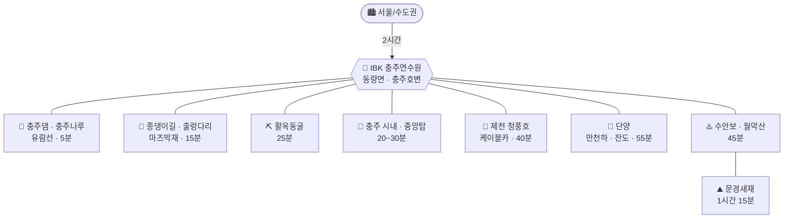

# IBK 충주연수원 베이스 가족여행 (2026년 가을)

> **대상**: 성인 2 + 8세 아이 1, 총 3인 · **이동**: 자차 · **출발지**: 수도권(서울 기준)
> **숙소**: **IBK기업은행 충주연수원** — 충북 충주시 동량면 화암양목길 12 (**충주댐 바로 위, 충주호변**)
> **성향**: 짚와이어·알파인코스터 같은 고강도 액티비티 제외. **걷기 · 경치 · 편하게 타는 것**(케이블카·유람선·모노레일·전동차) 중심
> **날짜**: 10월 말 vs 11월 초 — 아래 §1에서 결정

---

## 0. 결론부터 (TL;DR)

### 🗓️ 최적 시기: **11월 6일(금) ~ 8일(일) 2박3일**

10월 24~25일은 **단풍이 아직 이릅니다.** 월악산 기준 첫 단풍이 10월 23일경 시작해서 **절정이 11월 4일 전후**입니다(2025년 실측). 게다가 충주호·청풍호 **호반 단풍은 산 능선보다 5~7일 더 늦게** 물듭니다. 연수원이 호수 바로 앞이라 이 차이가 그대로 창밖 풍경으로 돌아옵니다.

### 🚗 최적 코스

| Day | 코스 |
|---|---|
| **금** | 서울 → **문경새재**(단풍 절정) → 수안보 → **연수원 체크인** → **종댕이길 노을 산책** |
| **토** | **청풍호 풀데이** — 청풍호반케이블카(비봉산 정상) → 옥순봉 출렁다리 → 청풍문화재단지 |
| **일** | **충주나루 유람선 첫배** → 충주댐 → 점심 → 13:30 귀경 |

연수원이 **충주댐·충주호 바로 앞**이라, 기존에 생각하던 "충주 시내 관광"보다 **호수를 축으로 도는 코스**가 훨씬 유리합니다. 종댕이길·충주나루 유람선·충주댐이 전부 차로 5~15분 거리, 청풍호가 40분입니다.

---

## 1. 시기 결정 — 10월 말 vs 11월

### 근거 데이터

- 산림청은 매년 단풍 절정을 **10월 하순~11월 초**로 전망합니다. 충청권도 같은 구간입니다.
- **월악산 2025년 실측**: 첫 단풍 **10월 23일경**, 절정 **11월 4일경**.
- **호반 단풍은 산보다 늦습니다.** 고도가 낮고 호수가 기온을 잡아주기 때문에, 충주호·청풍호 수변은 대체로 **11월 첫째 주~둘째 주 초반**이 절정입니다.

### 후보 주말 비교

| 시기 | 단풍 | 기온(아침/낮) | 혼잡 | 시설 운영 | 종합 |
|---|---|---|---|---|---|
| **10/23(금)~25(일)** | ⚠️ **40~60%** — 산 능선만 물듦, 호반은 이제 시작 | 6~8℃ / 18℃ | 보통 | ✅ 하계 09:00~18:00 | ★★★☆☆ |
| **10/30(금)~11/1(일)** | 🟡 **75~85%** — 산은 절정 직전, 호반은 한창 물드는 중 | 5~7℃ / 17℃ | 🔴 **최고조** | ⚠️ **11/1부터 동계 단축** | ★★★★☆ |
| **11/6(금)~8(일)** | ✅ **95~100%** — 산 절정 직후, **호반 단풍 절정** | 3~6℃ / 15℃ | 높음(금요일로 상쇄) | ⚠️ 동계 10:00~17:00 | ★★★★★ |
| **11/13(금)~15(일)** | 🟡 **50~70%** — 낙엽 시작, 그 대신 한산 | 0~3℃ / 12℃ | ✅ 낮음 | ⚠️ 동계 10:00~17:00 | ★★★☆☆ |

### 11월로 갈 때 감수해야 할 것 (솔직하게)

1. **운영시간이 2시간 줄어듭니다.** 청풍호반케이블카·옥순봉 출렁다리가 **3~10월 09:00~18:00 → 11~2월 10:00~17:00**. 딱 11월 1일부터 바뀝니다. 하루 활동 가능 시간이 짧아지니 **일정을 3개 이상 넣지 말아야** 합니다.
2. **해가 빨리 집니다.** 충주 기준 일몰이 10월 24일 약 17:40 → 11월 7일 약 17:25. 야외 일정은 **16:30까지 마무리**.
3. **아침이 춥습니다.** 11월 초 충주호변 아침 3~5℃, 호수 안개도 잦습니다(안개 자체는 사진이 예쁩니다).
4. **11월 첫 주말은 전국이 단풍 성수기**입니다. 토요일 오전 청풍·단양 주차장은 10시면 찹니다.

### 📌 최종 권고

**1순위: 11/6(금)~8(일) 2박3일.** 호반 단풍 절정 + 금요일 출발로 인파 회피 + 일요일 조기 귀경까지 세 마리를 다 잡습니다.
**2순위: 10/30(금)~11/1(일).** 10/31까지는 하계 운영시간(09~18)이라 하루를 길게 씁니다. 단풍은 85% 정도.
**3순위(원래 계획): 10/24~25.** 단풍을 목적으로 한다면 아쉽습니다. 대신 **덜 붐비고 하루가 길다**는 장점은 확실합니다.

> ⚠️ 단풍 시기는 해마다 **±1주** 흔들립니다(2025년은 가을 폭염으로 늦어짐). **산림청 단풍예측지도가 9월 말~10월 초 발표**되니, 그때 한 번 보고 ±1주 조정하시면 됩니다. 연수원 예약이 먼저 잡혀야 한다면 **11월 첫째 주**로 잡아두는 게 기댓값이 가장 높습니다.

---

## 2. 베이스 재확인 — 연수원 위치가 코스를 바꾼다

**IBK기업은행 충주연수원 · 충주시 동량면 화암양목길 12**
충주댐 바로 위, 충주호 서쪽 초입입니다. 충주 시내와는 20분쯤 떨어져 있고, 대신 **호수 관련 스팟이 전부 코앞**입니다.

**자차 편도 소요시간 (연수원 기준, 주말 +20분)**

| 목적지 | 시간(약) | 비고 |
|---|---|---|
| 충주댐 · 충주나루 선착장 | **5분** | 사실상 걸어서도 가는 거리 |
| 종댕이길(마즈막재/심항산) | **15분** | 충주호반 트레킹, 무료 |
| 충주 시내 | 20분 | |
| 활옥동굴 | 25분 | |
| 중앙탑사적공원 | 30분 | |
| 청풍호(제천 청풍면) | **40분** | 호수 건너 북동쪽 |
| 수안보 온천 | 45분 | |
| 단양 | 55분~1시간 | |
| 문경새재 | 1시간 15분 | 수안보·이화령 경유 |
| 서울 | 2시간 | |

> 💡 **위치가 준 힌트**: 문경은 시내 숙소 기준보다 **20분 더 멀어졌고**, 청풍호·단양·충주호는 **더 가까워졌습니다.** 그래서 아래 코스는 **호수 축**으로 다시 짰습니다.

---

## 3. 추천 코스 — 2박3일 (11/6 금 ~ 11/8 일)

### Day 1 (금) — 문경 단풍길 → 호수 도착

| 시간 | 일정 | 메모 |
|---|---|---|
| 07:30 | 서울 출발 | 금요일 아침은 정체 거의 없음 |
| 09:50~12:30 | **문경새재도립공원** | 입장 무료. 제1관문 → **전동차** → 제2관문 → 오픈세트장. 11월 초 새재 계곡 단풍이 가장 좋은 구간 |
| 12:45~13:50 | 점심 — 새재 입구 (약돌돼지 석쇠구이 / 된장찌개) | |
| 14:00~15:10 | **이화령 → 수안보 → 연수원** 드라이브 | 3번 국도 단풍 터널. 수안보 족욕 30분 옵션 |
| 15:10 | **연수원 체크인** | |
| 15:40~17:10 | **종댕이길 짧은 구간 산책** (마즈막재 주차 → 생태연못 → 출렁다리 왕복) | 전체 8.5km/3시간은 8세에겐 과함. **출렁다리 왕복 1시간 30분**만 |
| 17:30~ | 저녁 / 휴식 | 일몰 17:25, 어두워지기 전 복귀 완료 |

> 🔁 **문경을 빼고 싶다면**: 서울 → **수안보** → **월악산 미륵대원지·송계계곡 드라이브**(단풍 명소) → 연수원. 이동이 왕복 1시간 줄고 아이 부담도 적습니다.

### Day 2 (토) — 청풍호 풀데이 (호반 단풍의 하이라이트)

| 시간 | 일정 | 메모 |
|---|---|---|
| 09:20 | 연수원 출발 | 케이블카가 **10:00 오픈(동계)**이라 서두를 필요 없음 |
| 10:00~11:40 | **청풍호반케이블카** → 비봉산 정상 전망대 | 청풍호 단풍 **파노라마**. 8세도 무섭지 않은 밀폐형 곤돌라. 정상에서 20~30분 여유 |
| 12:00~13:10 | 점심 — 청풍면 일대 | |
| 13:30~14:40 | **옥순봉 출렁다리** | 호수 위 222m. 걷는 부담 적고 아이가 제일 좋아하는 포인트 |
| 15:00~16:20 | **청풍문화재단지** | 수몰 마을을 옮겨 복원한 곳. 잔디밭·전망대, 아이가 뛰어놀기 좋음 |
| 16:20~17:00 | 연수원 복귀 | |
| 18:00~ | 저녁 / 휴식 | |

> ⚠️ **케이블카·출렁다리 모두 월요일 휴무**. 11~2월은 **10:00~17:00** 단축 운영.
> 💳 옥순봉 출렁다리는 **카드 결제만** 됩니다. 3,000원 결제 시 2,000원을 제천화폐로 돌려줍니다. **만 7세 미만 무료 → 8세는 유료.**
> 🔁 **단양으로 바꾸고 싶다면**: 만천하스카이워크(**모노레일 + 전망대만**, 슬라이드·짚와이어 제외) → 구경시장 점심 → 단양강 잔도 → 도담삼봉. 볼거리는 더 많지만 왕복 2시간 이동에 걷는 양도 많습니다. **단풍 뷰 자체는 청풍호가 낫습니다.**

### Day 3 (일) — 충주호 유람선 → 조기 귀경

| 시간 | 일정 | 메모 |
|---|---|---|
| 08:30 | 체크아웃 (짐 차에 싣기) | |
| 09:00~10:40 | **충주나루 유람선 첫배** | 연수원에서 **차로 5분**. 충주댐·월악산 능선을 물 위에서 봄. 왕복 1시간~1시간 30분 |
| 10:50~11:30 | **충주댐 전망대 / 물문화관** | 짧게. 아이가 댐 구조 보는 걸 의외로 좋아함 |
| 11:45~13:00 | 점심 — 충주 시내 (중앙탑 막국수 / 올갱이해장국) | |
| **13:30** | **출발 → 서울** | 일요일은 이 시각을 넘기면 1시간 이상 더 걸림 |
| 15:30 | 서울 도착 | |

> ⚠️ **유람선은 반드시 전날 전화 확인.** 가을~겨울 **갈수기 수위 저하로 결항·단축 운항**이 잦고, 기상에 따라 첫배가 밀립니다.
> 🔁 **유람선 결항 시 대체**: **활옥동굴**(25분, 투명카약·실내라 날씨 무관) 또는 **중앙탑사적공원 + 탄금호**.

---

## 4. 1박2일 버전 (11/7 토 ~ 11/8 일)

1박2일이면 **문경은 뺍니다**(왕복 2시간 30분이 통째로 사라집니다). 호수에 집중하는 게 맞습니다.

| 시간 | Day 1 (토) |
|---|---|
| 07:30 | 서울 출발 |
| 10:00~11:40 | **청풍호반케이블카** (비봉산 정상) |
| 12:00~13:10 | 청풍 점심 |
| 13:30~14:40 | **옥순봉 출렁다리** |
| 15:30 | **연수원 체크인** |
| 16:00~17:10 | **충주댐 · 호수 노을** (또는 종댕이길 짧게) |

| 시간 | Day 2 (일) |
|---|---|
| 09:00~10:40 | **충주나루 유람선** |
| 11:00~12:30 | **종댕이길 출렁다리 왕복** 또는 **활옥동굴** |
| 12:40~13:50 | 점심 |
| **14:00** | 출발 → 16:00 서울 |

---

## 5. 후보지 카드 (액티비티 제외 · 걷기/경치/탈것 중심)

> 요금·시간은 조사 시점 기준. **출발 3일 전 재확인 필수.**

### 연수원 반경 30분 — 충주호권

| 장소 | 운영 | 요금 | 휴무 | 아이 반응 |
|---|---|---|---|---|
| **충주나루 유람선** | 계절별 상이 (☎ 사전 확인) | 선사별 상이 | 기상·수위 결항 | ★★★★★ 앉아서 보는 단풍 |
| **종댕이길** (전체 8.5km / 3시간) | 상시 | **무료** | 없음 | ★★★★ **출렁다리 왕복 구간만** 추천 |
| **충주댐 · 물문화관** | 주간 | 무료 | 확인 필요 | ★★★ |
| **활옥동굴** | 09:00~18:00 (입장마감 17:00, **체험마감 16:00**) | 성인 10,000 / 어린이 8,000, **투명카약 +5,000** | **월요일** | ★★★★★ 우천 시 1순위 |
| 중앙탑사적공원 · 탄금호 | 상시 | 무료 | 없음 | ★★★★ |
| 충주 아쿠아리움 | 주간 | 무료(소규모) | 확인 필요 | ★★★ |

### 반경 1시간 — 청풍 · 단양

| 장소 | 운영 | 요금 | 휴무 | 아이 반응 |
|---|---|---|---|---|
| **청풍호반케이블카** | 3~10월 09~18 / **11~2월 10~17** | 홈페이지 확인 (☎043-643-7301) | **월요일** | ★★★★★ 단풍 파노라마 |
| **옥순봉 출렁다리** | 3~10월 09~18 / **11~2월 10~17** | 3,000원(2,000원 제천화폐 환급) · **카드만** | **월요일** | ★★★★★ |
| 청풍문화재단지 | 주간 | 유료 | 확인 필요 | ★★★★ |
| **만천하스카이워크** (전망대·모노레일) | 계절별 상이 | dytc.or.kr 확인 (☎043-421-0014) | 홈페이지 확인 | ★★★★ *슬라이드·짚와이어는 제외* |
| **단양강 잔도** | 상시 | 무료 | 없음 | ★★★★ 절벽 데크길 |
| 도담삼봉 · 석문 | 상시 | 무료(주차 유료) | 없음 | ★★★ |
| 단양구경시장 | 낮 | — | | ★★★★ 먹거리 |
| 수양개빛터널 | 야간 포함 | 유료 | 확인 필요 | ★★★★ 우천 대안 |

### 반경 1시간 이상 — 수안보 · 월악산 · 문경

| 장소 | 운영 | 요금 | 휴무 | 아이 반응 |
|---|---|---|---|---|
| **문경새재도립공원** | 상시 | **입장 무료**(주차 유료) | 없음 | ★★★★★ 11월 초 단풍 |
| ↳ 문경새재 전동차 | 09:30~17:30 | 편도 성인 2,000 / 어린이 500 | | ★★★★★ 오르막 스킵 |
| 월악산 미륵대원지 · 송계계곡 | 상시 | 무료 | 없음 | ★★★ 드라이브 |
| 수안보 온천 | 시설별 | 시설별 | | ★★★ 다리 풀기 |
| 문경 오미자테마터널 | 주간 | 유료 | 확인 필요 | ★★★ 우천 대안 |
| *에코랄라(문경에코월드)* | 10:00~18:00 | 성인 10,000 / 어린이 9,000 | 키즈월드 월·화·수 휴장 | *짚라인 빼면 값어치 ↓ → **이번엔 제외*** |

---

## 6. 예산 개요 (3인, 숙박 제외)

| 항목 | 2박3일 | 1박2일 |
|---|---|---|
| 유류비 (총 주행 500~600km) | 7~9만 | 5~6만 |
| 통행료 (왕복) | 3~4만 | 3~4만 |
| 입장·승선료 (액티비티 제외) | **7~12만** | 5~8만 |
| 식비 (3인 × 끼당 4~6만) | 15~24만 | 10~16만 |
| **합계** | **약 32~49만** | **약 23~34만** |

> 짚와이어·알파인코스터를 뺀 만큼 앞선 계획보다 **입장료가 8만 원 정도 줄었습니다.**

---

## 7. 실전 팁 (8세 아이 · 11월 초 · 호수변)

**동선 원칙**
- 11월은 운영시간이 짧으니 **하루에 "메인 1 + 서브 1"**. 3개 넣으면 마지막에서 무너집니다.
- **걷기(종댕이길·문경새재·잔도)와 앉아서 타기(유람선·케이블카·전동차)를 하루 안에 번갈아** 배치했습니다. 위 순서대로만 하면 체력 배분이 자동입니다.
- 종댕이길 8.5km 완주는 시도하지 마세요. **출렁다리 왕복 1시간 30분**이 8세에게 딱 맞습니다.

**11월 초 충주호변 날씨**
- 아침 **3~5℃**, 낮 **14~16℃**. 일교차 10℃ 이상 → **얇은 옷 여러 겹 + 바람막이 필수**.
- 호수 바람이 체감온도를 3~4℃ 더 떨어뜨립니다. **유람선·케이블카·출렁다리는 전부 바람 부는 곳**입니다. 아이 **목도리·얇은 장갑·모자**를 꼭 챙기세요.
- **일몰 약 17:25.** 야외 일정은 16:30에 접습니다.
- 아침 호수 안개가 잦습니다. 유람선 첫배가 지연될 수 있고, 대신 **안개 낀 충주호는 사진이 아주 예쁩니다.**

**챙길 것**
- 운동화(종댕이길은 흙길·데크 혼재), 여벌 양말, 목도리·장갑·모자, 멀미약(유람선·굽잇길), 보온병
- 옥순봉 출렁다리는 **카드 결제만** — 현금은 못 씁니다
- 활옥동굴 내부는 연중 **11~15℃**, 11월엔 오히려 바깥보다 따뜻합니다

**교통**
- 11월 첫 주말은 단풍 성수기입니다. **청풍·문경은 10시 이전 도착**이 안전합니다(케이블카는 10시 오픈이라 09:40 도착 목표).
- 귀경은 **일요일 13:30~14:00 출발**. 넘기면 중부내륙에서 1시간 이상 더 씁니다.

**우천 시 대체 (실내 위주)**
1. **활옥동굴** (연수원 25분, 실내, 투명카약)
2. 수양개빛터널 (단양)
3. 문경 오미자테마터널
4. 수안보 온천
5. 충주 라이트월드 (야간)

---

## 8. 출발 전 체크리스트

- [ ] **연수원 예약 가능 날짜 먼저 확인** → 가능하면 **11/6~11/8**, 차선 **10/30~11/1**
- [ ] 연수원 **조식/석식 제공 여부** — 제공되면 Day 2 저녁을 숙소로 당겨 동선이 짧아짐
- [ ] **9월 말~10월 초 산림청 단풍예측지도** 확인 후 ±1주 조정
- [ ] **충주나루 유람선 운항 여부** 전날 전화 확인 (갈수기 결항 잦음)
- [ ] 청풍호반케이블카·옥순봉출렁다리 **11월 동계 운영시간(10~17)** 및 **월요일 아님** 재확인
- [ ] 옥순봉 출렁다리용 **카드** 지참
- [ ] 아이 방한용품(목도리·장갑·모자), 멀미약, 상비약
- [ ] 차량 점검(타이어·워셔액·부동액), 하이패스 잔액

---

작성일 2026-08-12 · 운영시간·요금은 조사 시점 기준이며 방문 전 공식 채널 재확인 권장
