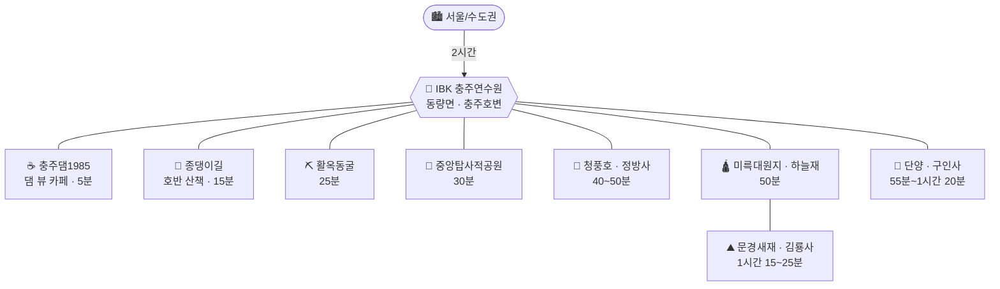

# IBK 충주연수원 베이스 가족여행 (2026년 가을)

> **대상**: 성인 2 + 8세 아이 1, 총 3인 · **이동**: 자차 · **출발지**: 수도권(서울 기준)
> **숙소**: **IBK기업은행 충주연수원** — 충북 충주시 동량면 화암양목길 12 (**충주댐 바로 위, 충주호변**)
> **취향**: 🚫 짚와이어·알파인코스터·출렁다리 같은 액티비티는 관심 없음
> ✅ **아름다운 절 · 경치 · 맛집 · 예쁜 카페 · 아이가 좋아할 볼거리** · **문경(문경새재) 강한 선호** · **활옥동굴 우선**
> **날짜**: 10월 말 vs 11월 초 — §1에서 결정

---

## 0. 결론부터 (TL;DR)

### 🗓️ 최적 시기: **11월 6일(금) ~ 8일(일) 2박3일**

월악산 기준 첫 단풍 10월 23일경, **절정 11월 4일 전후**(2025년 실측). 여기에 **호반 단풍은 산보다 5~7일 늦게** 물듭니다. 연수원이 충주호 바로 앞이니 이 차이가 창밖 풍경으로 그대로 돌아옵니다. (상세 비교는 §1)

### 🚗 최적 코스 — A안 (추천)

| Day | 코스 |
|---|---|
| **금** | 서울 → **문경새재**(전동차) → 문경 점심 → **미륵대원지 + 하늘재 옛길** → **충주댐1985 카페**(호수 노을) → 체크인 |
| **토** | **청풍호반케이블카**(비봉산 정상 단풍 파노라마) → 점심 → **정방사**(청풍호 절벽 암자) → 청풍호 뷰 카페 |
| **일** | **활옥동굴**(오픈런·투명카약) → 중앙탑사적공원 → 점심 → 13:30 귀경 |

**절 3곳이 자연스럽게 코스에 박힙니다.**
- **미륵대원지** — 문경↔충주 길목 정확히 한가운데. 석굴 절터 + 국보급 석불입상, **무료·연중무휴**
- **정방사** — 청풍호가 발밑에 펼쳐지는 절벽 암자. 청풍 코스에 그대로 붙음
- **김룡사·대승사** — 문경을 한 번 더 원하면 B안(§4)에서 마지막 날에 배치

유람선은 뺐습니다. **활옥동굴이 아이 반응도 낫고, 가을 갈수기 결항 리스크도 없습니다.** 출렁다리도 뺐습니다(원하면 청풍 코스에 30분이면 끼워집니다).

---

## 1. 시기 결정 — 10월 말 vs 11월

- 산림청 전망: 전국 단풍 절정 **10월 하순~11월 초**. 충청권 동일.
- **월악산 2025년 실측**: 첫 단풍 **10/23경** → 절정 **11/4경**.
- **호반 단풍은 산보다 늦습니다.** 고도가 낮고 호수가 기온을 잡아줘서 충주호·청풍호 수변은 **11월 첫째 주~둘째 주 초반**이 절정입니다.
- 사찰 단풍(김룡사·구인사 등)도 대체로 **10월 중순~11월 초**가 피크입니다.

| 시기 | 단풍 | 기온(아침/낮) | 혼잡 | 시설 운영 | 종합 |
|---|---|---|---|---|---|
| 10/23(금)~25(일) | ⚠️ **40~60%** — 능선만 물듦 | 6~8℃ / 18℃ | 보통 | ✅ 하계 09~18 | ★★★☆☆ |
| 10/30(금)~11/1(일) | 🟡 **75~85%** | 5~7℃ / 17℃ | 🔴 최고조 | ⚠️ 11/1부터 동계 | ★★★★☆ |
| **11/6(금)~8(일)** | ✅ **95~100%** — 호반 절정 | 3~6℃ / 15℃ | 높음(금요일로 상쇄) | ⚠️ 동계 10~17 | ★★★★★ |
| 11/13(금)~15(일) | 🟡 **50~70%** — 낙엽 시작, 한산 | 0~3℃ / 12℃ | ✅ 낮음 | ⚠️ 동계 10~17 | ★★★☆☆ |

### 11월의 대가 (솔직하게)

1. **청풍호반케이블카가 11/1부터 10:00~17:00으로 2시간 단축**됩니다(3~10월은 09~18). 하루 일정을 3개 이상 넣으면 안 됩니다.
2. **일몰**이 10/24 약 17:40 → 11/7 약 17:25. 야외 일정은 **16:30 마감**.
3. 아침 3~5℃, 충주호변 안개 잦음(안개 낀 호수는 사진이 아주 예쁩니다).
4. **11월 첫 주말은 전국 단풍 성수기.** 토요일 오전 청풍 주차장은 10시면 찹니다 → 금요일 출발로 상쇄.

> ⚠️ 단풍은 해마다 **±1주** 흔들립니다(2025년은 가을 폭염으로 지연). **9월 말~10월 초 산림청 단풍예측지도** 확인 후 조정하세요. 연수원 예약을 먼저 잡아야 한다면 **11월 첫째 주**가 기댓값 최고입니다.
>
> ⚠️ **활옥동굴은 월요일 휴무**입니다. 11/6~8(금~일) 코스에서는 문제없습니다.

---

## 2. 베이스 — 연수원 위치가 코스를 정한다

**IBK기업은행 충주연수원 · 충주시 동량면 화암양목길 12** — 충주댐 바로 위, 충주호 서쪽 초입.

**자차 편도 소요시간 (연수원 기준, 주말 +20분)**

| 목적지 | 시간(약) | 비고 |
|---|---|---|
| 충주댐 · 충주댐1985 카페 | **5분** | 사실상 걸어서도 가는 거리 |
| 종댕이길(마즈막재/심항산) | 15분 | 호반 트레킹, 무료 |
| **활옥동굴** | **25분** | |
| 중앙탑사적공원 · 탄금호 | 30분 | |
| **청풍호반케이블카** | **40분** | |
| **정방사**(금수산) | 50분 | 청풍호 코스와 묶음 |
| **미륵대원지 · 하늘재** | 50분 | 수안보 경유 |
| 단양 | 55분~1시간 | |
| **문경새재** | 1시간 15분 | 수안보·이화령 경유 |
| 문경 김룡사 | 1시간 25분 | |
| 단양 구인사 | 1시간 20분 | |
| 서울 | 2시간 | |

> 💡 **미륵대원지가 전략 요충지입니다.** 문경새재에서 40분, 연수원에서 50분 — **문경 다녀오는 길 정확히 중간**에 걸립니다. 별도 시간을 안 써도 되는 절터입니다.

---

## 3. A안 (추천) — 2박3일 · 11/6(금) ~ 11/8(일)

### Day 1 (금) — 문경새재 + 옛길의 절터

| 시간 | 일정 | 메모 |
|---|---|---|
| 07:30 | 서울 출발 | 금요일 아침은 정체 거의 없음 |
| 09:50~12:20 | **문경새재도립공원** | 입장 무료. 제1관문 → **전동차**(편도 성인 2,000/어린이 500) → 제2관문 → **오픈세트장**. 11월 초 새재 계곡 단풍이 절정 |
| 12:35~13:45 | **문경 점심 — 약돌돼지 석쇠구이** | 새재 입구 식당가. 아이용은 된장찌개+공깃밥 |
| 14:20~15:40 | 🛕 **미륵대원지 + 하늘재 옛길** | 이화령·수안보 경유 40분. **무료·연중무휴**. 석굴 절터·석조여래입상·오층석탑 관람 30분 + 하늘재 방향 숲길 30분 걷다 회차 |
| 15:40~16:30 | → 연수원 방향 이동 | 3번 국도 단풍 드라이브 |
| 16:40~17:30 | ☕ **충주댐1985** (댐 뷰 카페) | 연수원 5분. 호수 위로 해 지는 시간대 |
| 17:40 | **연수원 체크인** / 저녁 | 일몰 17:25 |

> 🥾 **하늘재 완주는 하지 마세요.** 미륵대원지 주차장 → 하늘재 정상 **왕복 4km / 2시간**입니다. 8세 아이에겐 **편도 1km 지점까지 갔다가 회차(왕복 1시간)** 가 딱 맞습니다. 흙길·완만해서 운동화면 충분합니다.

### Day 2 (토) — 청풍호 경치 + 절벽 암자

| 시간 | 일정 | 메모 |
|---|---|---|
| 09:20 | 연수원 출발 | 케이블카 **10:00 오픈(동계)** |
| 10:00~11:40 | 🚡 **청풍호반케이블카** → 비봉산 정상 전망대 | 청풍호 단풍 **파노라마**. 밀폐형 곤돌라라 8세도 무서워하지 않음. 정상에서 20~30분 여유 |
| 12:00~13:10 | 점심 — 청풍·금성면 일대 | |
| 13:40~15:10 | 🛕 **정방사** | 금수산 절벽에 얹힌 암자. **법당 지붕 1/3을 천연 암반이 덮고 있는** 장면이 압권. 청풍호가 발밑에 통째로 펼쳐짐 |
| 15:30~16:40 | ☕ **청풍호 뷰 카페** | 청풍대교·금성면 일대에 호수 조망 카페 다수 |
| 17:10 | 연수원 복귀 / 저녁 | |

> 🚗 **정방사 진입로는 좁고 가파른 산길**입니다. 주차 후 도보 10~15분 오르막이 남습니다. 운전 자신 없으면 아래 주차장에 세우고 걸어 올라가세요.
> ➕ 시간이 남고 마음이 바뀌면 **옥순봉 출렁다리**를 30분에 끼워 넣을 수 있습니다(3,000원, 카드만, 만 7세 미만 무료 → 8세는 유료).
> 🔁 **단양으로 바꾸려면**: **구인사**(소백산 자락, 계단식으로 끝없이 올라가는 거대 산중사찰 — 단풍철 스케일이 압도적) + 단양강 잔도 + 구경시장. 왕복 2시간 30분이라 하루가 빠듯합니다.

### Day 3 (일) — 활옥동굴 + 조기 귀경

| 시간 | 일정 | 메모 |
|---|---|---|
| 08:30 | 체크아웃 | |
| 09:00~11:00 | ⛏️ **활옥동굴** | **09:00 오픈런.** 입장하자마자 **투명카약**부터 확보(체험마감 16:00이지만 주말은 조기 마감). 성인 10,000 / 어린이 8,000, 카약 +5,000 |
| 11:30~12:20 | **중앙탑사적공원 · 탄금호** | 무료. 잔디밭·조각공원, 아이가 뛰어놀기 좋음 |
| 12:30~13:20 | 점심 — 중앙탑 일대 (막국수 / 올갱이해장국) | |
| **13:30** | **출발 → 서울** | 일요일은 이 시각을 넘기면 1시간 이상 더 걸림 |
| 15:30 | 서울 도착 | |

> 🧥 동굴 내부는 연중 **11~15℃** — 11월엔 오히려 바깥보다 따뜻합니다. 그래도 겉옷은 챙기세요.
> ☔ **비가 와도 활옥동굴은 그대로 진행**됩니다. 오히려 우천 시 1순위입니다.

---

## 4. B안 — 문경 몰입형 (문경을 두 번 간다)

문경 비중을 더 키우고 싶다면 **청풍호를 포기하고 마지막 날을 문경 사찰로** 잡습니다. 문경 → 서울이 2시간 10분, 연수원 → 서울이 2시간이라 **귀경 손해가 10분뿐**입니다.

| Day | 코스 |
|---|---|
| **금** | 서울 → **문경새재** → 문경 점심 → **미륵대원지 + 하늘재** → 충주댐1985 카페 → 체크인 *(A안과 동일)* |
| **토** | 여유 데이 — **활옥동굴**(오전, 투명카약) → 충주 시내 점심 → **종댕이길** 호반 산책(오후) → 충주 카페 → 연수원 |
| **일** | 08:30 체크아웃 → **문경 김룡사**(10:00~11:20) → **대승사**(11:40~12:40) → 문경 점심 → **14:00 출발** → 16:10 서울 |

- **김룡사**: 신라 진평왕 10년(588) 창건. 계곡 옆 경사진 터에 전각을 아기자기하게 앉혀서 **시선 두는 곳마다 그림**입니다. 늦가을 단풍나무·은행나무 색이 특히 좋고, 무엇보다 **한적합니다.**
- **대승사**: 사불산 능선 가까이 좌우대칭으로 전각을 앉힌 절. 김룡사에서 차로 20분 남짓.

> **A안 vs B안**: 경치·다양성은 A안(청풍호 파노라마 + 정방사), 문경 밀도와 여유는 B안입니다. 아이 기준으로는 **A안이 변화가 많아 덜 지루합니다.**

---

## 5. 1박2일 버전 (11/7 토 ~ 11/8 일)

1박2일이면 문경과 청풍 중 **하나만** 고릅니다. 문경 선호를 반영하면 이쪽입니다.

| 시간 | Day 1 (토) |
|---|---|
| 07:00 | 서울 출발 |
| 09:20~11:50 | **문경새재** (전동차 + 오픈세트장) |
| 12:05~13:15 | 문경 점심 (약돌돼지) |
| 13:50~15:20 | **미륵대원지 + 하늘재 옛길** |
| 16:10~17:20 | ☕ **충주댐1985** (호수 노을) |
| 17:30 | 연수원 체크인 / 저녁 |

| 시간 | Day 2 (일) |
|---|---|
| 09:00~11:00 | ⛏️ **활옥동굴** (오픈런, 투명카약) |
| 11:30~12:20 | 중앙탑사적공원 · 탄금호 |
| 12:30~13:30 | 점심 |
| **14:00** | 출발 → 16:00 서울 |

---

## 6. 절 · 카페 · 맛집

### 🛕 절 (가까운 순)

| 절 | 연수원에서 | 요금 | 무엇이 좋은가 | 아이 |
|---|---|---|---|---|
| **미륵대원지**(미륵리사지) | 50분 | **무료** | 석굴을 주불전으로 삼은 절터. 석조여래입상·오층석탑·석등·불상대좌. **하늘재 옛길 들머리** | ★★★★ 큰 돌부처가 신기함 |
| **정방사** | 50분 | 무료 | 금수산 절벽 암자. **법당 지붕을 천연 암반이 덮고 있음.** 청풍호 조망 최고 | ★★★ 오르막 10~15분 |
| **김룡사** (문경) | 1시간 25분 | 무료 | 588년 창건. 계곡 옆 경사터에 전각 배치, **늦가을 단풍·은행 절경**, 한적함 | ★★★ |
| **대승사** (문경) | 1시간 30분 | 무료 | 사불산 능선, 좌우대칭 가람 배치 | ★★★ |
| **구인사** (단양) | 1시간 20분 | 무료 | 천태종 총본산. **계단식으로 끝없이 올라가는 거대 산중사찰**, 단풍 스케일 압도적 | ★★★★ 규모에 놀람 |

> 절은 대부분 **주차 무료·입장 무료**이고 이른 아침부터 열립니다. 사람 없는 시간대(9~10시)가 가장 좋습니다.

### ☕ 카페

| 카페 | 위치 | 포인트 |
|---|---|---|
| **충주댐1985** | 충주댐 인증센터 앞 (**연수원 5분**) | 댐·호수 뷰. 남한강 자전거길 종점. **Day 1 노을 시간대 강추** |
| 발리포레스트 | 충주 | 분위기·뷰로 유명, 사진 잘 나옴 |
| 청풍호 뷰 카페 | 제천 청풍·금성면 | 청풍대교 일대에 호수 조망 카페 다수 |
| 문경 오미자 카페 | 문경 | 지역 특산 오미자 음료 |

### 🍚 맛집 (방문 전 최신 리뷰 재확인 권장)

| 지역 | 메뉴 | 메모 |
|---|---|---|
| **문경** | **약돌돼지 석쇠구이** | 문경 대표 음식. 새재 입구 식당가에 밀집. 아이는 된장찌개 |
| 문경 | 약돌한우 | 조금 더 특별하게 먹고 싶을 때 |
| **충주** | 중앙탑 막국수 / 올갱이해장국 | 중앙탑공원 일대. Day 3 점심 동선에 맞음 |
| 충주 | 운정신태원(만두) | 시내 |
| 수안보 | 꿩요리 | 지역 명물이나 **아이 취향은 아님** |
| 단양 | 마늘떡갈비 / 구경시장 흑마늘닭강정·만두 | 단양 코스로 갈 경우 |

---

## 7. 예산 개요 (3인, 숙박 제외)

| 항목 | 2박3일 | 1박2일 |
|---|---|---|
| 유류비 (총 주행 500~600km) | 7~9만 | 5~6만 |
| 통행료 (왕복) | 3~4만 | 3~4만 |
| 입장·체험료 | **5~9만** | 4~6만 |
| 카페 (3인 × 2회) | 3~5만 | 2~3만 |
| 식비 (3인 × 끼당 4~6만) | 15~24만 | 10~16만 |
| **합계** | **약 33~51만** | **약 24~35만** |

> 절이 전부 무료라 입장료 부담이 거의 없습니다. 실질 비용은 **활옥동굴 + 케이블카 + 전동차** 정도입니다.

---

## 8. 실전 팁 (8세 아이 · 11월 초 · 호수변)

**동선 원칙**
- 11월은 운영시간이 짧으니 **하루에 "메인 1 + 서브 1"**. 위 표의 순서를 그대로 지키면 체력 배분이 자동입니다.
- **걷기(문경새재·하늘재·정방사)와 앉아서 타기(전동차·케이블카)를 하루 안에 번갈아** 배치했습니다.
- 아이가 절에서 지루해하지 않으려면 **한 곳에 30~40분** 이상 머물지 마세요. 미륵대원지처럼 **큰 석불·석탑이 눈에 확 들어오는 곳**이 반응이 좋습니다.

**11월 초 날씨**
- 아침 **3~5℃**, 낮 **14~16℃**. 일교차 10℃ 이상 → **얇은 옷 여러 겹 + 바람막이**.
- 호수 바람이 체감을 3~4℃ 더 떨어뜨립니다. 케이블카 정상·호반 카페 테라스는 특히 춥습니다 → **목도리·얇은 장갑·모자**.
- **일몰 약 17:25.** 야외 일정은 16:30에 접습니다.

**챙길 것**
- 운동화(하늘재·정방사·종댕이길은 흙길), 여벌 양말, 보온병, 멀미약(굽잇길 많음), 상비약
- 활옥동굴 겉옷 (내부 11~15℃)
- 절 방문 시 조용히 — 법당 안 촬영은 피하기

**교통**
- 11월 첫 주말 = 단풍 성수기. 청풍호반케이블카는 **09:40 도착** 목표(10시 오픈).
- 귀경은 **일요일 13:30~14:00 출발**. 넘기면 중부내륙에서 1시간 이상 더 씁니다.

**우천 시 대체**
1. **활옥동굴** — 실내, 날씨 무관. A안이면 순서만 Day 3 ↔ Day 2로 바꾸면 됨
2. 수양개빛터널 (단양)
3. 문경 오미자테마터널
4. 수안보 온천
5. 충주 라이트월드 (야간)

---

## 9. 출발 전 체크리스트

- [ ] **연수원 예약 가능 날짜 확인** → 1순위 **11/6~8**, 2순위 **10/30~11/1**
- [ ] 연수원 **조식/석식 제공 여부** — 제공되면 저녁 일정을 숙소로 당겨 동선 단축
- [ ] **9월 말~10월 초 산림청 단풍예측지도** 확인 후 ±1주 조정
- [ ] **활옥동굴** — 주말 투명카약 운영 여부 당일 오전 전화 확인 (**월요일 휴무**)
- [ ] **청풍호반케이블카** — 11월 동계 운영시간(10:00~17:00) 및 **월요일 아님** 확인
- [ ] **정방사 진입로** 상태 확인 (좁은 산길, 겨울 초입 결빙 주의)
- [ ] 문경새재 전동차 운행 여부 (09:30~17:30)
- [ ] 카페·맛집 영업일 재확인 (지방 카페는 평일 휴무가 잦음)
- [ ] 아이 방한용품(목도리·장갑·모자), 멀미약, 상비약
- [ ] 차량 점검(타이어·워셔액·부동액), 하이패스 잔액

---

작성일 2026-08-12 · 운영시간·요금은 조사 시점 기준이며 방문 전 공식 채널 재확인 권장
