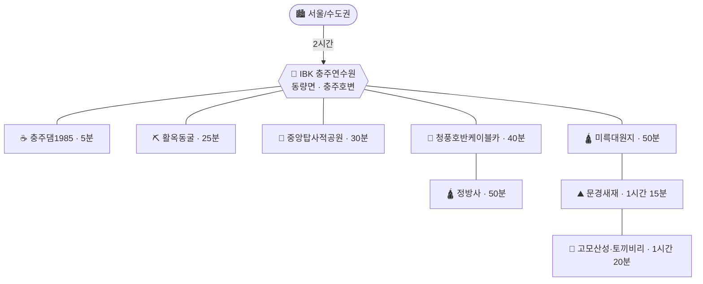

# IBK 충주연수원 베이스 가족여행 (2026년 가을)

> **대상**: 성인 2 + 8세 아이 1, 총 3인 · **이동**: 자차 · **출발지**: 수도권(서울 기준)
> **숙소**: **IBK기업은행 충주연수원** — 충북 충주시 동량면 화암양목길 12 (**충주댐 바로 위, 충주호변**)
> **취향**: 🚫 짚와이어·알파인코스터·출렁다리 관심 없음
> ✅ **아름다운 절 · 경치 · 맛집 · 예쁜 카페 · 아이 볼거리** · **문경 옛길 걷기 + 성곽** · **활옥동굴 우선**
> **일정**: **2박3일 · 금~일 확정** → 날짜는 **11/6(금) ~ 11/8(일)** 권장 (근거는 §1)

---

## 0. 확정 — 이것만 갑니다

### 🛕 절은 **2곳**으로 압축

| 절 | 언제 | 왜 이 절인가 | 뺀 이유가 없는 이유 |
|---|---|---|---|
| **정방사** (제천 금수산) | **Day 2** | **"아름다운 절" 단 하나만 고르면 여기.** 금수산 절벽에 얹혀 있고, **법당 지붕 3분의 1을 천연 암반이 그대로 덮고** 있습니다. 마당에 서면 청풍호가 발밑에 통째로 펼쳐집니다 | 청풍호 케이블카 코스에 **그대로 붙습니다.** 추가 이동 10분 |
| **미륵대원지** (충주 미륵리) | **Day 1** | 절이 아니라 **절터**입니다. 석굴을 주불전으로 삼았고 **키 큰 석조여래입상·오층석탑**이 서 있어 아이 눈에 확 들어옵니다. 무료·연중무휴 | **문경 → 연수원 길 정확히 중간.** 별도 시간을 거의 안 씁니다 |

**뺀 절과 이유** — 좋지만 이번 코스와는 충돌합니다.
- **김룡사**(문경): 아름답고 한적하지만, Day 1이 이미 **문경새재 + 고모산성**으로 꽉 찹니다. 문경을 한 번 더 가는 §4 B안에서만 살립니다.
- **구인사**(단양): 스케일은 최고지만 편도 1시간 20분 — **하루를 통째로 먹습니다.** 청풍호를 포기해야 해서 손익이 안 맞습니다.

### ⛰️ 문경은 **걷기 + 성곽**으로 채웁니다

| 코스 | 무엇 | 걷는 양 | 난이도 |
|---|---|---|---|
| **문경새재 1~2관문** | **주흘관(제1관문) · 조곡관(제2관문)** 두 성문과 좌우로 뻗은 성벽 + 오픈세트장 | 편도 3km | ⭐ 거의 평지 고운 흙길. 유모차도 가능 |
| **고모산성 + 토끼비리** | 산허리를 따라 **복원된 산성 성벽** + 절벽에 매달린 **1.6km 영남대로 옛길**, 진남교반 조망 | 1.5~2km | ⭐⭐ 가벼운 트레킹, 가족 코스 |

### 🚗 3일 코스

| Day | 코스 |
|---|---|
| **금** | 서울 → **문경새재**(전동차로 올라 걸어 내려오기) → 문경 점심 → **고모산성·토끼비리** → 🛕**미륵대원지** → 체크인 |
| **토** | **청풍호반케이블카**(비봉산 정상 단풍 파노라마) → 점심 → 🛕**정방사** → ☕청풍호 뷰 카페 |
| **일** | ⛏️**활옥동굴**(오픈런·투명카약) → ☕충주댐1985 → 점심 → 13:30 귀경 |

---

## 1. 날짜 결정 — **11/6(금) ~ 11/8(일)**

**2박3일 · 금~일 확정.** 남은 선택지는 금요일 출발 기준 셋뿐이고, 실질 경쟁은 **10/30 vs 11/6** 두 개입니다.

| 후보 | 단풍 | 기온(아침/낮) | 혼잡 | 운영시간 | 종합 |
|---|---|---|---|---|---|
| 10/23~25 | ⚠️ **40~60%** — 능선만 물듦 | 6~8℃ / 18℃ | 보통 | ✅ 전부 성수기 | **탈락** |
| 10/30~11/1 | 🟡 **75~85%** | 5~7℃ / 17℃ | 🔴 **연중 최고조** | ✅ 금·토 성수기 | ★★★★☆ |
| **11/6~8** | ✅ **95~100%** | 3~6℃ / 15℃ | 🟡 높음(금요일로 상쇄) | ⚠️ 전부 동계 | **★★★★★ 채택** |
| 11/13~15 | 🟡 **50~70%** — 낙엽 시작 | 0~3℃ / 12℃ | ✅ 낮음 | ⚠️ 전부 동계 | ★★★☆☆ |

### 근거 데이터

- 산림청 전망: 전국 단풍 절정 **10월 하순~11월 초**. 충청권 동일.
- **월악산 2025년 실측**: 첫 단풍 10/23경 → **절정 11/4경**.
- **호반 단풍은 산보다 5~7일 늦습니다.** 고도가 낮고 호수가 기온을 잡아주기 때문입니다.

### 10/30~11/1 vs 11/6~8 — 정면 비교

**① 이 코스는 산 하나에 호수 둘입니다 → 11/6 우세**

| Day | 지형 | 10/30~11/1 | 11/6~8 |
|---|---|---|---|
| 금 · 문경새재 | ⛰️ 산·계곡 | ✅ **절정** | 🟡 절정 끝물, 계곡 하부는 아직 |
| 토 · 청풍호 | 🌊 호반 | 🟡 70~80% | ✅ **절정** |
| 일 · 충주호변 | 🌊 호반 | 🟡 70~80% | ✅ **절정** |

**사흘 중 이틀이 호수**입니다. 게다가 숙소 창밖이 충주호라 호반 단풍은 일정표에 없는 시간에도 계속 눈에 들어옵니다.

**② 운영시간은 10/30이 우세 (약 1시간 30분 이득)**

11/1부터 동계로 바뀌므로, 10/30~11/1은 **금·토 이틀을 성수기 시간표로** 씁니다.

| | 10/30~11/1 | 11/6~8 | 차이 |
|---|---|---|---|
| 금 · 문경새재 전동차 | **09:30** 시작 | 10:00 시작 | +30분 |
| 토 · 청풍호반케이블카 | **09:00~18:00** | 10:00~17:00 | +1시간 |
| 일 · 활옥동굴 | 09:00~18:00 | 09:00~18:00 | 동일(연중 무관) |
| 일몰 | 약 17:33 | 약 17:25 | +8분 |

**③ 혼잡은 11/6이 우세**

**10월 마지막 주말(10/31 토)이 전국 단풍 인파의 연중 정점**입니다. 청풍호반케이블카 대기가 가장 길 날이 정확히 그날입니다. 11/7도 붐비지만 산 단풍 피크가 지나 분산됩니다.

**④ 결정타 — 어긋날 때의 손해가 비대칭입니다**

단풍은 해마다 ±1주 흔들리는데, **최근 몇 년은 계속 "늦어지는" 쪽으로 어긋나고 있습니다**(2025년은 가을 폭염으로 지연). 즉 빠를 확률보다 늦을 확률이 큽니다.

| | 예상보다 **늦어지면** | 예상보다 **빨라지면** |
|---|---|---|
| **10/30~11/1** | 🔴 60~70%로 추락 — **여행의 전제가 무너짐** | ✅ 완벽 |
| **11/6~8** | ✅ **오히려 정확히 적중** | 🟡 문경만 낙엽, **호수 이틀은 여전히 좋음** |

11/6~8은 **어느 쪽으로 어긋나도 최소 이틀이 살아남습니다.** 10/30~11/1은 늦어지는 순간 사흘이 같이 무너집니다. 운영시간 1시간 30분보다 이쪽이 훨씬 큽니다.

### 📌 결론

> ### **11월 6일(금) ~ 11월 8일(일)**
> 잃는 것은 **하루 활동시간 1시간 30분**, 얻는 것은 **호반 단풍 절정 + 인파 분산 + 어긋남에 대한 방어**입니다.

**되돌릴 조건 한 가지** — **9월 말~10월 초 산림청 단풍예측지도**가 나옵니다. 거기서 충청권이 **"평년보다 이르다"** 로 나오면 그때만 **10/30~11/1로 당기세요.** 그 경우 케이블카 09:00 오픈까지 덤으로 따라옵니다.

> ⚠️ **활옥동굴 월요일 휴무** — 금~일 코스라 어느 날짜든 문제없습니다.
> ⚠️ 두 후보 주간 모두 지역 축제 일정은 확인되지 않았습니다. 확정 전 충주시·문경시·제천시 문화관광 페이지에서 그 주말 행사 여부만 훑어보세요(주차 혼잡에 직결됩니다).

---

## 2. 베이스 — 소요시간

**IBK기업은행 충주연수원 · 충주시 동량면 화암양목길 12** (충주댐 바로 위)

| 구간 | 시간(약) |
|---|---|
| 연수원 → 충주댐1985 카페 | 5분 |
| 연수원 → 활옥동굴 | 25분 |
| 연수원 → 중앙탑사적공원 | 30분 |
| 연수원 → 청풍호반케이블카 | 40분 |
| 케이블카 → **정방사** | **10분** |
| 연수원 → **미륵대원지** | 50분 |
| **미륵대원지 → 문경새재** | **40분** (이화령 경유) |
| 문경새재 → **고모산성(진남휴게소)** | 20분 |
| 고모산성 → 미륵대원지 | 50분 |
| 서울 ↔ 연수원 / 문경 | 2시간 / 2시간 10분 |

---

## 3. A안 (추천) — 2박3일 · 11/6(금) ~ 11/8(일)

### Day 1 (금) — 문경 옛길·성곽 풀데이

> 🔑 **핵심 트릭: 문경새재는 전동차로 올라가서 걸어 내려옵니다.** 그러면 3km가 전부 내리막이라 아이 체력이 절반만 듭니다. 오르막에 힘을 다 쓰고 오후 고모산성에서 주저앉는 사태를 막습니다.

| 시간 | 일정 | 메모 |
|---|---|---|
| **07:00** | 서울 출발 | 3개를 넣는 날이라 30분 앞당깁니다 |
| 09:20 | **문경새재도립공원** 도착 | 입장 무료 / 주차 유료 |
| 09:25~09:55 | **옛길박물관 · 은행나무 가로수길 · 제1관문(주흘관)** | ⚠️ **전동차가 11월엔 10:00부터** 운행하므로 이 시간을 여기에 씁니다. 주흘관 성벽을 먼저 보고 올라갑니다 |
| 10:00~10:15 | 🚋 **전동차 C코스** → 제2관문(조곡관) | 5,000원. **금요일=평일이라 상시 운행** (주말은 오전·오후 각 2회뿐) |
| 10:15~12:15 | 🚶 **조곡관 → 교귀정 → 조령원터 → 오픈세트장 → 주흘관** 3km 내리막 | 성문 2곳 통과. 오픈세트장 관람 30~40분 포함 |
| 12:25~13:15 | 🍚 **점심 — 약돌돼지 석쇠구이** | 새재 입구 식당가. 아이는 된장찌개+공깃밥 |
| 13:35~15:00 | 🏯 **고모산성 + 토끼비리** | **진남휴게소 주차**(넓음) → 오미자테마터널 옆 산책로 → 복원된 산성 성벽 → **절벽에 매달린 토끼비리 1.6km** → 진남교반 전망 |
| 15:50~16:30 | 🛕 **미륵대원지** | 석굴 절터·석조여래입상·오층석탑. **무료·연중무휴.** 40분이면 충분 |
| 16:30~17:20 | → **연수원 체크인** | 일몰 17:25, 딱 맞춰 도착 |
| 18:00~ | 저녁 / 휴식 | 이 날이 가장 빡셉니다. 일찍 재우세요 |

> ⚠️ **C코스가 안 되면 (Plan B)**: A코스(오픈세트장까지, 2,000원)를 타고 **오픈세트장 ↔ 제2관문 왕복 4km를 걷지 말고**, 오픈세트장에서 제1관문으로 바로 내려옵니다. 조곡관을 못 보는 대신 오후 일정이 온전히 살아납니다. 성곽 욕구는 **고모산성**이 채워줍니다.

> ✂️ **컷 포인트**: 아이가 지쳤거나 시간이 밀리면 **미륵대원지를 뺍니다.** 절의 본편은 Day 2 정방사이고, 미륵대원지는 "길목이라 공짜로 얻는 보너스"입니다.
> 🥾 **하늘재 옛길은 이번엔 넣지 않습니다.** 미륵대원지에서 왕복 4km / 2시간인데, 이미 문경새재 3km + 토끼비리 1.6km를 걸은 뒤라 과합니다.

### Day 2 (토) — 청풍호 경치 + 정방사

| 시간 | 일정 | 메모 |
|---|---|---|
| 09:20 | 연수원 출발 | 케이블카 **10:00 오픈(동계)** |
| 10:00~11:40 | 🚡 **청풍호반케이블카** → 비봉산 정상 전망대 | 청풍호 단풍 **파노라마**. 밀폐형 곤돌라라 8세도 안 무서워함. 정상에서 20~30분 |
| 12:00~13:10 | 점심 — 청풍·금성면 일대 | |
| 13:30~15:00 | 🛕 **정방사** | 케이블카에서 **10분**. 주차 후 도보 10~15분 오르막. **법당 지붕을 덮은 천연 암반**과 청풍호 조망이 이 여행의 그림 한 장 |
| 15:20~16:40 | ☕ **청풍호 뷰 카페** | 청풍대교·금성면 일대 호수 조망 카페 |
| 17:10 | 연수원 복귀 / 저녁 | |

> 🚗 **정방사 진입로는 좁고 가파른 산길**입니다. 11월 초 이른 아침엔 결빙 가능성도 있으니, 운전이 부담되면 아래 주차장에 세우고 걸어 올라가세요.
> ➕ 마음이 바뀌면 **옥순봉 출렁다리**를 30분에 끼울 수 있습니다(3,000원, 카드만, 8세는 유료).

### Day 3 (일) — 활옥동굴 + 조기 귀경

| 시간 | 일정 | 메모 |
|---|---|---|
| 08:30 | 체크아웃 | |
| 09:00~11:00 | ⛏️ **활옥동굴** | **09:00 오픈런.** 들어가자마자 **투명카약**부터 확보(체험마감 16:00이지만 주말은 조기 마감). 성인 10,000 / 어린이 8,000, 카약 +5,000 |
| 11:30~12:20 | ☕ **충주댐1985** 또는 **중앙탑사적공원** | 카페는 댐·호수 뷰, 중앙탑은 무료 잔디밭 |
| 12:30~13:20 | 점심 — 중앙탑 막국수 / 올갱이해장국 | |
| **13:30** | **출발 → 서울** | 넘기면 1시간 이상 더 걸립니다 |
| 15:30 | 서울 도착 | |

> 🧥 동굴 내부 연중 **11~15℃** — 11월엔 오히려 바깥보다 따뜻합니다.
> ☔ 비가 와도 그대로 진행됩니다. 우천 시 1순위 카드입니다.

---

## 4. B안 — 문경을 두 번 가고 **김룡사**를 살리는 버전

문경 비중을 더 키우고 싶다면 **청풍호(+정방사)를 포기하고** 마지막 날을 문경 사찰로 씁니다. 문경 → 서울 2시간 10분, 연수원 → 서울 2시간이라 **귀경 손해는 10분**입니다.

| Day | 코스 |
|---|---|
| **금** | 서울 → **문경새재**(전동차 → 걸어 내려오기) → 점심 → **고모산성·토끼비리** → 🛕**미륵대원지** → 체크인 *(A안과 동일)* |
| **토** | 여유 데이 — ⛏️**활옥동굴**(오전, 투명카약) → 충주 점심 → **종댕이길** 호반 산책 → ☕충주댐1985 |
| **일** | 08:30 체크아웃 → 🛕**김룡사**(10:00~11:20) → 문경 점심 → **14:00 출발** → 16:10 서울 |

- **김룡사**: 신라 진평왕 10년(588) 창건. 계곡 옆 경사진 터에 전각을 아기자기하게 앉혀서 **시선 두는 곳마다 그림**입니다. 늦가을 단풍나무·은행나무 색이 특히 좋고, 무엇보다 **한적합니다.**
- 시간이 남으면 차로 20분 거리의 **대승사**(사불산, 좌우대칭 가람)를 붙일 수 있습니다.

> **A안 vs B안**: **경치의 절정은 A안**(청풍호 파노라마 + 절벽 암자 정방사), **문경 밀도와 여유는 B안**입니다. 아이 기준으로는 A안이 변화가 많아 덜 지루합니다.

---

## 5. 상세 정보

### ⛰️ 문경 — 걷기 · 성곽

#### 코스 구조 — 관문 3개가 일렬로 놓인 옛길

문경새재는 **하나의 계곡길에 관문 세 개가 순서대로 박혀 있는 구조**입니다. 갈림길을 고민할 일이 없고, **어디까지 갔다가 돌아올지만 정하면 됩니다.**

| 구간 | 거리 | 도보 | 이 구간의 볼거리 |
|---|---|---|---|
| 주차장 → **제1관문 주흘관** | 약 0.5km | 10분 | **옛길박물관**, 은행나무 가로수길, 잔디마당 |
| 주흘관 → **오픈세트장** | 약 1km | 20분 | **오픈세트장**(광화문·전통마을 세트, 드라마 촬영지) |
| 오픈세트장 → **제2관문 조곡관** | 약 2km | 40분 | **조령원터**(옛 여관터), **교귀정**(경상감사 인수인계 장소, 1999년 재건), 용추, 조곡폭포 |
| 조곡관 → **제3관문 조령관** | 약 3.5km | 1시간 20분 | 이진터, 동화원, 책바위, 조령약수 / 조령관은 **충북 괴산 경계** |

- **제1관문 → 제3관문 편도 6.5km, 2시간 30분** (여유 있게 3시간). 8세 아이와는 **제2관문까지가 상한선**입니다.
- 주차장 → 제2관문 **편도 약 3.5km / 왕복 7km, 약 2시간.**
- 노면은 **경사가 거의 없는 고운 흙길**이라 유모차·휠체어도 다닙니다. 등산화 필요 없습니다.
- 💧 코스 중간 약수터(조령약수·조곡약수)는 **수질검사 결과에 따라 음용 불가일 수 있으니** 제1관문 근처에서 물을 챙겨 올라가세요.

#### 🚋 전동차 — **운행합니다. 단, 조건이 있습니다**

| 항목 | 내용 |
|---|---|
| **코스** | **A코스** 옛길박물관 → **오픈세트장** / **C코스** 옛길박물관 → **제2관문 조곡관** |
| **요금** | A코스 **2,000원** · C코스 **5,000원** (편도 기준 성인 2,000 / 청소년·군인 800 / 어린이 500) |
| **운행시간** | 성수기 09:30~17:30 / ⚠️ **비수기(11/1~2/28) 10:00~17:00** |
| **C코스 운행 조건** | ⚠️ **평일 상시 운행 / 주말·공휴일은 오전·오후 각 2회만** |
| **동절기** | 12월 A코스 연장 운행, **C코스는 안전상 임시 중지** → 겨울 휴장 후 **3월 1일 재개** |
| **문의** | **문경새재전동차 054-572-6768** |

**👉 이 여행에 주는 결론 세 가지**

1. **11월 6일은 금요일 = 평일**이라 **C코스가 상시 운행**됩니다. Day 1을 금요일로 잡은 게 여기서 또 한 번 이득입니다.
2. **11월은 10:00 시작**입니다(09:30 아님). 그래서 Day 1 일정에 **09:25~09:55 옛길박물관·주흘관 구간**을 먼저 넣었습니다.
3. **주말·공휴일에 가면 C코스가 오전·오후 각 2회뿐**입니다. 혹시 일정이 토요일로 밀리면 회차 시각을 **반드시 전화로 확인**하거나, 처음부터 A코스로 계획하세요.

👉 **추천 방식**: 전동차로 제2관문까지 올라간 뒤 **3km를 걸어 내려오기.** 두 성문과 성벽을 다 통과하고 오픈세트장·교귀정·조령원터가 순서대로 나와서 아이가 지루해할 틈이 없습니다. 무엇보다 **전 구간이 내리막**입니다.

**고모산성 + 토끼비리** · 무료
- **주차: 진남휴게소** (넓음). 오미자테마터널 옆 산책로에서 시작합니다.
- 삼국시대부터 조선까지 **영남대로의 요충지**였던 산성. 산허리를 따라 성벽이 복원돼 있습니다.
- **토끼비리**는 깎아지른 절벽에 낸 **1.6km 옛길**. 성곽 + 벼랑길 + **진남교반 조망**이 한 번에 나옵니다.
- 가벼운 트레킹 수준이라 가족 코스로 무난합니다. **운동화 필수.**

### 🛕 절 (확정 2곳)

| 절 | 연수원에서 | 요금 | 포인트 | 아이 |
|---|---|---|---|---|
| **정방사** | 50분 (케이블카에서 10분) | 무료 | 금수산 절벽 암자. **법당 지붕 1/3을 천연 암반이 덮음.** 청풍호 조망 최고 | ★★★ 오르막 10~15분 |
| **미륵대원지** | 50분 (문경 길목) | **무료·연중무휴** | 석굴 주불전 절터. 석조여래입상·오층석탑·석등·불상대좌 | ★★★★ 큰 돌부처가 신기함 |

*(이번엔 제외: **김룡사** — B안에서만 / **대승사** — B안 옵션 / **구인사** — 편도 1시간 20분)*

### ☕ 카페

| 카페 | 위치 | 포인트 |
|---|---|---|
| **충주댐1985** | 충주댐 인증센터 앞 (**연수원 5분**) | 댐·호수 뷰. 남한강 자전거길 종점 |
| 청풍호 뷰 카페 | 제천 청풍·금성면 | 청풍대교 일대 호수 조망 카페 다수 |
| 발리포레스트 | 충주 | 분위기·뷰로 유명 |
| 문경 오미자 카페 | 문경 | 지역 특산 오미자 음료 |

### 🍚 맛집 (방문 전 최신 리뷰 재확인 권장)

| 지역 | 메뉴 |
|---|---|
| **문경** | **약돌돼지 석쇠구이** (새재 입구 식당가) / 약돌한우 |
| **충주** | 중앙탑 막국수 · 올갱이해장국 / 운정신태원(만두) |
| 제천 청풍 | 청풍·금성면 일대 (선택지가 많지 않으니 미리 검색) |
| 수안보 | 꿩요리 — 지역 명물이나 **아이 취향은 아님** |

---

## 6. 예산 개요 (3인, 숙박 제외)

| 항목 | 금액 |
|---|---|
| 유류비 (총 주행 550~650km) | 8~10만 |
| 통행료 (왕복) | 3~4만 |
| 입장·체험료 (활옥동굴 + 케이블카 + 전동차) | 5~9만 |
| 카페 (3인 × 2회) | 3~5만 |
| 식비 (3인 × 8끼, 끼당 4~6만) | 15~24만 |
| **합계** | **약 34~52만** |

> 절·성곽이 전부 무료라 실질 비용은 **활옥동굴 + 케이블카 + 전동차** 정도입니다.

---

## 7. 실전 팁

**Day 1 체력 관리 (가장 중요)**
- 이 날 걷는 총량이 **약 4.5~5km**입니다(새재 3km + 토끼비리 1.5~2km). 8세에게 불가능한 양은 아니지만, **새재를 걸어 올라갔다가 내려오면 6km가 되어 오후가 무너집니다.** 전동차 상행은 선택이 아니라 필수입니다.
- 점심 후 바로 걷지 말고 **차 안에서 20분 이동하며 쉬는 구간**을 그대로 지키세요(설계에 넣어뒀습니다).

**11월 초 날씨**
- 아침 **3~5℃**, 낮 **14~16℃**. 일교차 10℃ 이상 → **얇은 옷 여러 겹 + 바람막이**.
- 호수 바람이 체감을 3~4℃ 더 낮춥니다(케이블카 정상, 카페 테라스) → **목도리·얇은 장갑·모자**.
- **일몰 약 17:25.** 야외 일정은 16:30에 접습니다.

**절에서**
- 아이가 지루해하지 않으려면 **한 곳에 30~40분** 이상 머물지 마세요.
- 법당 안 촬영은 피하고, 마당·석탑 위주로 도세요. **미륵대원지의 큰 석불이 아이 반응이 가장 좋습니다.**

**챙길 것**
- **운동화 필수** (토끼비리는 절벽 옛길, 새재는 흙길)
- 활옥동굴용 겉옷, 보온병, 멀미약(굽잇길 많음), 상비약
- 아이 방한용품(목도리·장갑·모자)

**교통**
- 11월 첫 주말은 단풍 성수기. 케이블카는 **09:40 도착** 목표(10시 오픈).
- 귀경은 **일요일 13:30~14:00 출발.**

**우천 시**
1. **활옥동굴** (실내) — Day 2 ↔ Day 3 순서만 바꾸면 됨
2. 문경 오미자테마터널 (고모산성 들머리 바로 옆)
3. 수안보 온천 / 충주 라이트월드(야간)

---

## 8. 출발 전 체크리스트

- [ ] **연수원 2박 예약 (11/6 금 · 11/7 토)** → 차선 10/30~11/1
- [ ] **9월 말~10월 초 산림청 단풍예측지도** 확인 — 충청권이 "평년보다 이르다"로 나올 때만 10/30~11/1로 당김
- [ ] 해당 주말 **지역 축제 유무** 확인 (충주시·문경시·제천시 문화관광) — 주차 혼잡 직결
- [ ] 연수원 **조식/석식 제공 여부** (제공되면 저녁 동선 단축)
- [ ] ☎️ **문경새재전동차 054-572-6768** — Day 1 설계의 전제. 확인할 것 세 가지
  - [ ] **11월에도 C코스(제2관문)를 운행하는지** (12월엔 안전상 중지되므로 11월 말 상황 확인)
  - [ ] **비수기 운행 시작 시각이 10:00이 맞는지**
  - [ ] (토요일 방문 시) **C코스 오전 회차 시각**
- [ ] **활옥동굴** 주말 투명카약 운영 여부 당일 오전 확인 (**월요일 휴무**)
- [ ] **청풍호반케이블카** 11월 동계 운영시간(10~17) 및 **월요일 아님** 확인
- [ ] **정방사 진입로** 상태 확인 (좁은 산길, 결빙 주의)
- [ ] 고모산성 주차 = **진남휴게소**
- [ ] 카페·맛집 영업일 재확인 (지방 카페는 평일 휴무 잦음)
- [ ] 운동화 · 아이 방한용품 · 멀미약
- [ ] 차량 점검(타이어·워셔액·부동액), 하이패스 잔액

---

작성일 2026-08-12 · 운영시간·요금은 조사 시점 기준이며 방문 전 공식 채널 재확인 권장
